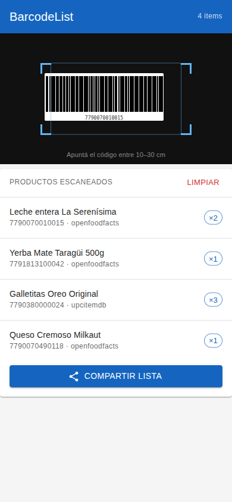
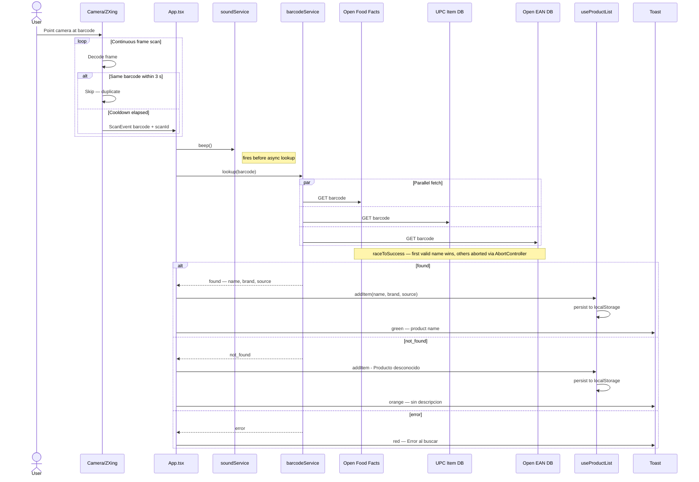

# BarcodeList

Mobile-first barcode scanner PWA — scan grocery products with your iPhone camera and keep a running list.

**Live app:** https://castocolina.github.io/barcode-list/

## Screenshot



## What This Does

Point your phone camera at any product barcode (EAN-13, UPC-A, QR, etc.) and the app looks up the product name from three free APIs in parallel. Each scan adds the item to a persistent list with a beep confirmation. Scan the same barcode twice and it increments the quantity instead of adding a duplicate. Share the final list as a CSV to Google Drive, Files, WhatsApp, or any app via the native iOS share sheet.

## Features

- Rear camera with continuous autofocus, optimized for 10–30 cm scanning distance
- Parallel product lookup from Open Food Facts, UPC Item DB, and Open EAN DB — first valid result wins, others are cancelled
- Per-barcode 3-second deduplication cooldown (prevents double-scans from hand tremor)
- Beep on scan (Web Audio API — no audio files)
- Toast notifications: green for found, orange for unknown, red for API error
- Quantity accumulation: scanning the same barcode again shows `×2`, `×3`, etc.
- List persists in `localStorage` with a 7-day rolling expiry (resets on each scan)
- Export to CSV via native OS share sheet (or direct download fallback on unsupported browsers)

## How It Works



## Tech Stack

- **Framework**: React 18 + Vite + TypeScript
- **UI**: MUI v7 (Material Design)
- **Barcode scanning**: `@zxing/library`
- **Persistence**: `localStorage`
- **Export**: Web Share API
- **Hosting**: GitHub Pages via GitHub Actions

## Getting Started

```bash
pnpm install
pnpm dev
```

Open `http://localhost:5173/barcode-list/` in a browser.

> **Note:** Camera access requires HTTPS. On `localhost` a camera error is expected — the list, export, and clear dialog are fully functional. Test camera scanning from the deployed URL.

```bash
pnpm test -- --run   # run all tests (40 tests)
pnpm build           # production build → dist/
```

## Deploying

1. Push the repo to GitHub as `barcode-list`
2. Go to **Settings → Pages → Source** and select the `gh-pages` branch, root `/`
3. Push any commit to `main` — GitHub Actions builds and deploys automatically

The workflow runs all 40 tests before every deploy (`.github/workflows/deploy.yml`).

## Known Limitations

- **HTTPS required** — camera access is blocked on `http://` (except localhost)
- **UPC Item DB** — 100 free lookups/day; the other two APIs continue working if the limit is hit
- **iOS focus** — no browser on iOS exposes manual camera focus via WebAPI; continuous autofocus works well in practice at 10–30 cm
- **localStorage is per device/browser** — the list does not sync across devices
